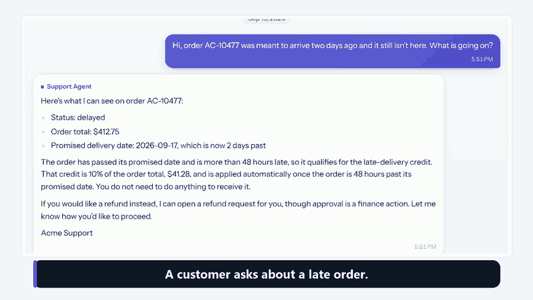
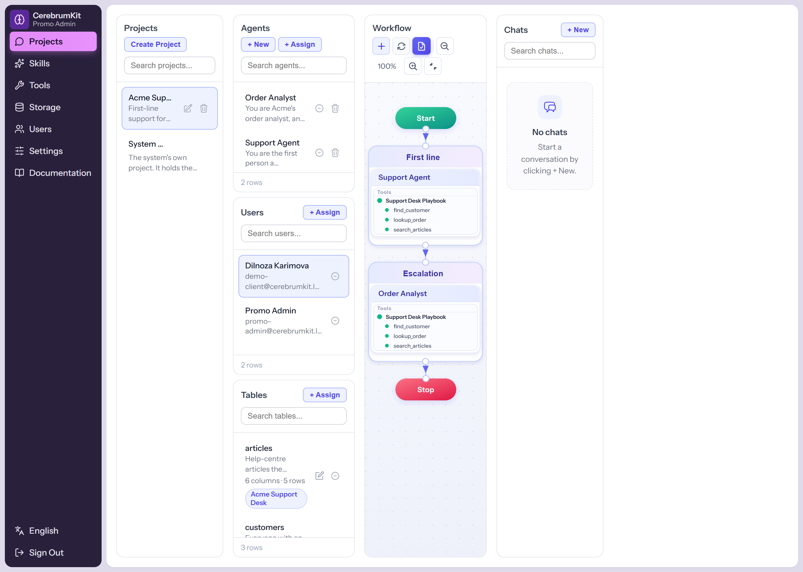
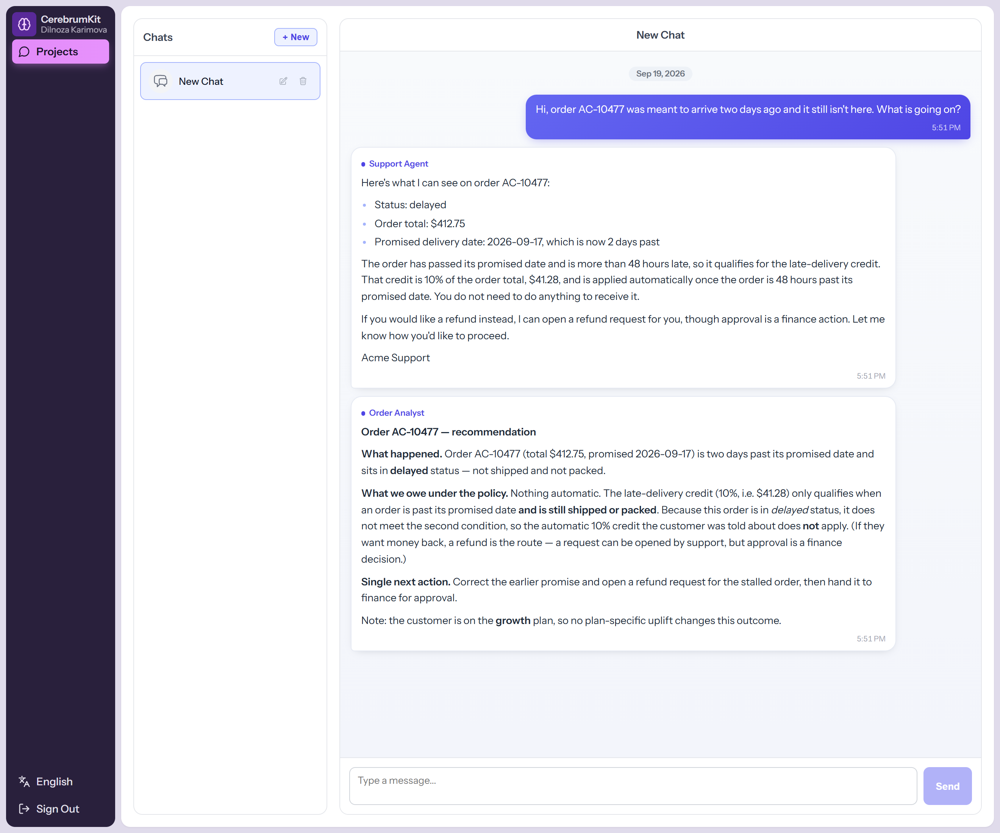
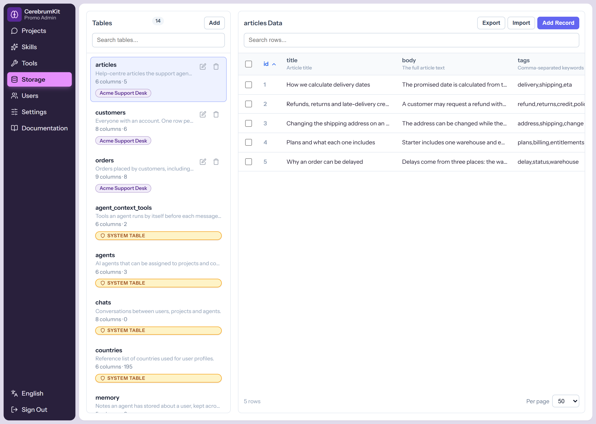
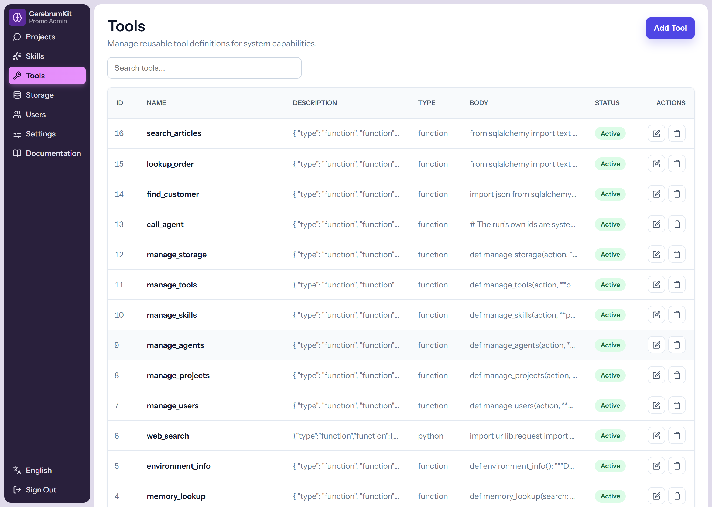

# CerebrumKit

[](LICENSE)


[](https://codespaces.new/islomkhon/CerebrumKit)

A starting point for agentic projects. You get an admin panel where agents are
built out of **skills** and **tools**, a storage library of business tables you
can hand those agents, and a client panel where the people the project is for
talk to them.

Nothing in here belongs to any particular business: no catalogue, no orders, no
product tables. What is here is the machinery every such project needs, so a new
project starts at "what should the agents do" instead of at "how do I run an
agent loop".



**[🎥 Watch the whole run - 71 seconds, captioned, no audio](https://youtu.be/yz9uJA67-IY)**

## Try it without installing anything

[](https://codespaces.new/islomkhon/CerebrumKit)

That link opens this repository in a container in your own GitHub account. It
installs both halves against SQLite, seeds the demo data, and starts the backend
and the panel: two minutes, nothing to install, no configuration. The two
accounts it creates are:

| Account | Email | Password |
| --- | --- | --- |
| Admin | `admin@cerebrumkit.test` | `cerebrumkit-demo-password` |
| Client | `client@cerebrumkit.test` | `cerebrumkit-demo-password` |

The agents have no model to answer with until the install has one: add a key in
**Admin -> Settings -> LLM Connections**, or set a Codespace secret named
`DEEPSEEK_API_KEY` and rebuild. Everything else - both panels, the storage
library, the skills and tools, the workflow canvas - works as soon as it starts.

That container belongs to your account, so it spends your Codespaces allowance
rather than someone else's, and it is not a place for real data. For an install
you intend to keep, use the quickstart below.

## Status

Early, and honest about it. The agent loop, the tool and skill registry, storage,
chats, memory, delegation, users and roles, and the admin and client panels all
work and are used daily. What is missing is a hosted public instance and a test
suite - there is a [71-second walkthrough](https://youtu.be/yz9uJA67-IY) if you
would rather watch than read, and a
[container that comes up seeded](#try-it-without-installing-anything) if you
would rather poke at it, but that container is an instance in your own account
rather than one link that opens for everyone.

Two things to know before you run it anywhere real:

- **A tool body is code execution.** Bodies run with full builtins and are not
  sandboxed, deliberately - the shipped tools import `requests`, SQLAlchemy and
  app internals. Tool authoring is admin-only for that reason, and
  `tools.body` should be reviewed like a commit.
- **One process.** The websocket registry and in-flight agent tasks live in
  process memory, so the deploy runs a single uvicorn worker.

## What you get

- **Projects** - a project groups members, agents and the storage tables they
  may use, and holds the **workflow**: start / groups / stop, wired on a canvas,
  which decides which agents answer a message and in what order.
- **Agents** - a name, a description that is its system prompt, and the skills
  it carries. It answers chats in the project it belongs to.
- **Skills and tools** - a tool is an OpenAI function spec plus a Python body
  (both stored in the database, both editable in the panel). A skill is a
  written instruction plus the tools it needs. Give an agent the skill and the
  tools come with it. A generator turns a description into a first draft spec.
- **Storage** - create tables in the panel and they exist in the database, with
  import/export to Excel and row editing. Tables are assigned to projects, and a
  tool can read and write them.
- **Chats** - a websocket per chat drives the agent loop: it picks the agents
  from the workflow, runs the tools they ask for, streams tool cards and text
  into the transcript, and can be stopped mid-run.
- **Memory** - agents can write notes about a user, keyed by agent and user so a
  note written in one chat is readable in that user's other chats with the same
  agent.
- **Delegation** - one agent can hand a self-contained task to another agent in
  the project and use the answer.
- **Users and roles** - `admin` sees everything and builds the projects;
  `client` sees their own projects and chats and nothing else.
- **The System project** - a project that cannot be renamed or deleted, holding
  a **Project Manager** agent whose tools let it create and edit users,
  projects, agents, skills, tools and storage tables. An install can be
  administered by asking it in chat.

## See it

**The admin panel is where the agents are built.** A project owns its members,
its agents and its tables, and the workflow on the right decides which agent
answers a message and in what order - every node carries the skills and tools it
runs with.



**The client panel is what the people the project is for actually see.** One chat
per conversation, the agents answering in order, and the user's own projects and
nothing else.



In the screenshot above the first agent answers from the tables, then the
escalation group's analyst reads the same order and corrects the policy the first
agent applied - which is the whole point of putting more than one agent in a
workflow.

**Storage is a table editor over real Postgres tables**, with a description on
the table and on every column, because those descriptions are what the model
reads when it decides which tool to call.



**A tool is a function spec plus a Python body, both database rows.** The panel
edits both; the next message uses the new version, with no restart and no deploy.



## Requirements

- Python 3.12+ and Node 20+
- PostgreSQL (or SQLite for a quick look, by leaving `DATABASE_URL` on its
  default)

## Quickstart

```bash
# 1. Database
docker compose up -d              # or point DATABASE_URL at an existing server
createdb cerebrumkit              # when you run Postgres yourself

# 2. Backend
cd backend
python -m venv venv
venv/Scripts/python.exe -m pip install -r requirements.txt      # Windows
# source venv/bin/activate && pip install -r requirements.txt   # macOS / Linux
cp .env.example .env              # then set DATABASE_URL, SECRET_KEY,
                                  # DEEPSEEK_* and the SEED_* accounts
venv/Scripts/python.exe seed_all.py

# 3. Frontend
cd ../frontend/cerebrumkit-vue
npm install
npm run dev
```

Open <http://localhost:5173> and sign in with the `SEED_ADMIN_EMAIL` /
`SEED_PASSWORD` you set in `backend/.env`.

### Accounts and credentials

`seed.py` creates two accounts, and both sign in with the same password:

| Account | Email | What it reaches |
| --- | --- | --- |
| Admin | `SEED_ADMIN_EMAIL` | The whole admin panel |
| Client | `SEED_CLIENT_EMAIL` | Only the projects assigned to that user |

No default pair is shipped in the code. All three values come from
`backend/.env`, and `seed_all.py` stops with an error while any of them is
empty, so a fresh checkout has no login anyone could guess:

```bash
SEED_ADMIN_EMAIL=admin@example.com
SEED_CLIENT_EMAIL=client@example.com
SEED_PASSWORD=the-password-you-choose
SEED_ADMIN_COUNTRY=CN
SEED_CLIENT_COUNTRY=CN
```

To change the password afterwards, edit the user in **Admin -> Users**;
re-running the seeder leaves an account that already exists untouched.

> `SEED_PASSWORD` is one secret shared by both accounts, and it is the pair an
> attacker tries first. Change it before the install is reachable from anywhere
> but your own machine.

`seed_all.py` creates the tables, the country list, the admin and client
accounts, the general tools and skills, and the System project with its Project
Manager agent. Every step is idempotent, so running it again is safe.

It also copies `DEEPSEEK_*` into the `platforms` table, which is what the system
actually runs on. After that, Admin -> Settings -> LLM Connections is the place
to change provider, base URL, API key or model: the active row is used by the
whole system, and the `DEEPSEEK_*` values only matter while the table is empty.

On Windows you can also double-click through `run.ps1`, which starts both
servers and `stop.ps1` stops them.

## First project

Either build it in the panel (Projects -> Create Project), or ask the Project
Manager in the System project's chat to do it for you. The order that works:

1. **Storage** - create the tables the project owns, with a description on the
   table and on each column. Tools read these, and the agent sees the
   descriptions.
2. **Tools** - one per thing an agent should be able to do. Write the Python
   body if you know it, or describe the tool and let the generator draft the
   spec. Bodies run with `project_id`, `chat_id`, `agent_id`, `user_id` and
   `call_depth` already in scope.
3. **Skills** - group the tools under written instructions: when to use them,
   what to pass, how to read the result.
4. **Agents** - a description that is the agent's standing brief, plus the
   skills it carries. Optional: tools to run *before* every message, whose
   output is injected into the prompt (useful for "always know the catalogue").
5. **Project** - assign the tables, add the agents, and wire the workflow so
   messages reach them.
6. **Users** - create client accounts and add them to the project; they see only
   their own projects and chats.

Change the seeded passwords before anyone else can reach the install.

## Layout

```
backend/
  app/
    core/          agent loop, tool execution, delegation, auth, config
    models/        SQLAlchemy models: users, projects, agents, skills, tools,
                   chats, messages, memory, storage registry
    routers/       REST + websocket API
    schemas/       request/response models
    system_management.py   the manage_* tools the Project Manager uses
  seed_all.py      fresh install in one command
  seed_*.py        the individual seed steps
  export_for_deploy.py, load_for_deploy.py   move data between installs
frontend/cerebrumkit-vue/
  src/views/admin/     Projects (agents, chats, workflow), Skills, Tools,
                       Storage, Users
  src/views/client/    Projects and the chat with the agents
  src/locales/         en, zh, ru, es, fr, de
```

## How it fits together

A message arrives on the chat websocket. The agent loop reads the project
workflow, picks the agent or group that should answer, builds the system prompt
from the agent's description plus its skills plus any pre-run tool output, and
calls the model. Tool calls come back as function calls; each is executed
against the tool body stored in the database, with the project, chat, agent and
user ids injected so a tool can only ever touch its own run. Results go back to
the model, and the text it produces is broadcast to the chat.

Tool and skill definitions live in the database rather than in the code, so
editing one in the panel takes effect on the next run with no restart and no
deploy.

## Deploying

See `DEPLOY.md` for nginx, systemd and a rebuild path that keeps the database
rows (tools, skills, agents) in step with the code.

## Adding a business domain

Add your models under `backend/app/models/`, register them in
`app/models/__init__.py`, add routers and schemas the same way, and create the
tables with `backend/migrate.py`. Anything a project needs at runtime is better
as a tool over the storage library, because then the people who own the project
can change it without a deploy.

## Author


### Islomkhon Nizomkhonov (小伊)

- **Education**: Master's degree in Computer Science, China University of Mining
  and Technology
- **Key skills**: Software Engineering, Deep Learning, Machine Learning, Data
  Science, IoT, Predictive Maintenance

Islomkhon Nizomkhonov was born in 1994 in Tashkent, Uzbekistan. He is a senior
software engineer with more than six years of experience in machine learning and
predictive maintenance. He has worked with several industries and large
companies, including [XCMG (徐工集团)](https://www.xcmg.com/) and
[Uztelecom (Uzbekistan's national telecom provider)](https://uztelecom.uz/),
where he delivered solutions built on deep learning techniques. His research
focuses on the use of neural networks for fault diagnosis in industrial IoT
systems. Today his main interests are **AI agents**, **software engineering for
and with AI**, and **trustworthy AI**. If you would like to cooperate or discuss
a use case, please do not hesitate to contact him by email at
[islomkhon@126.com](mailto:islomkhon@126.com) or by phone at +86 139 1487 4257.

## License

Apache License 2.0 - see [LICENSE](LICENSE) and [NOTICE](NOTICE).

Anyone may use, modify and redistribute this software, including commercially.
In return the license asks that you keep the copyright notice, the license text
and the `NOTICE` file with any copy or derivative work, and note the files you
changed. It comes with no warranty, and it includes an express grant of patent
rights from contributors, so a contributor cannot later assert a patent over
code they contributed. The name and logo are not covered by the license, so a
fork needs its own branding.
